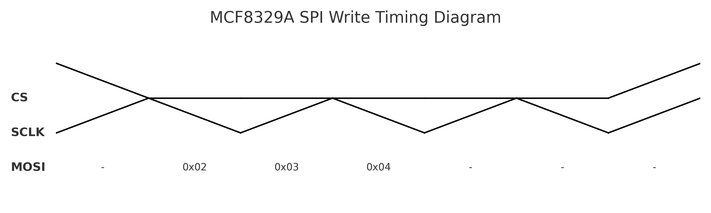
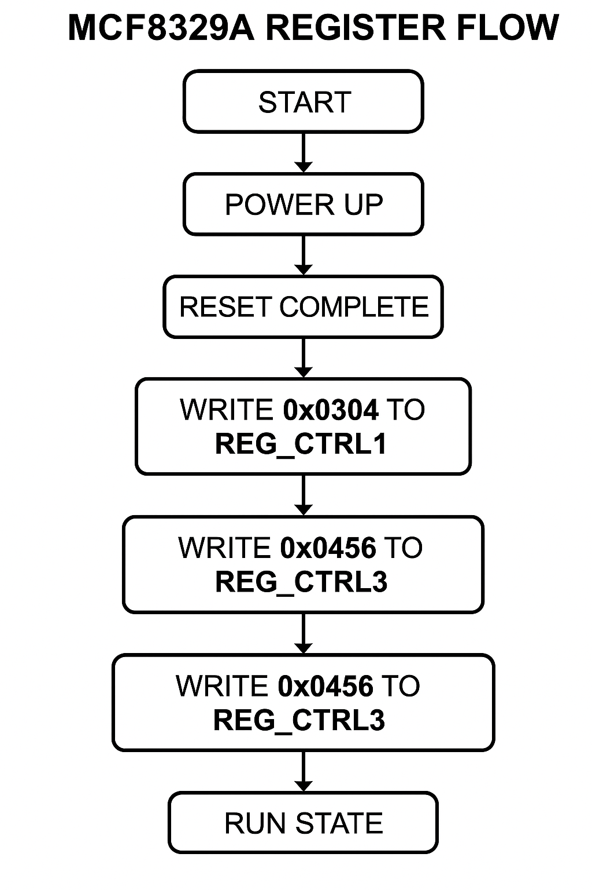
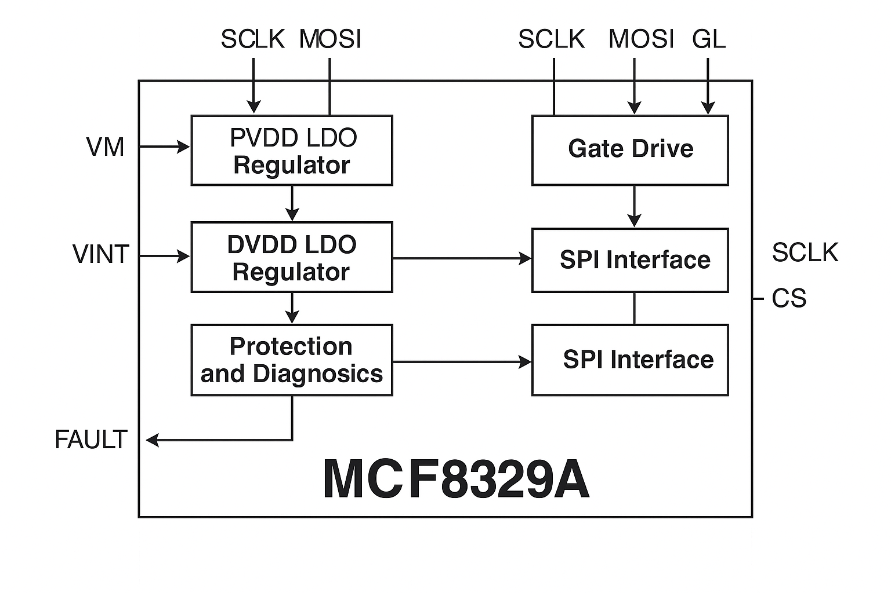
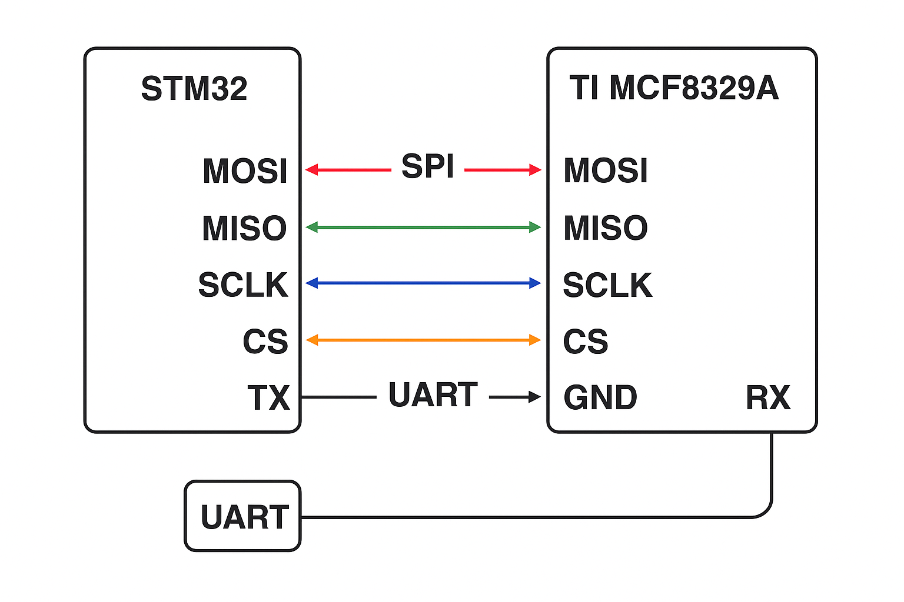
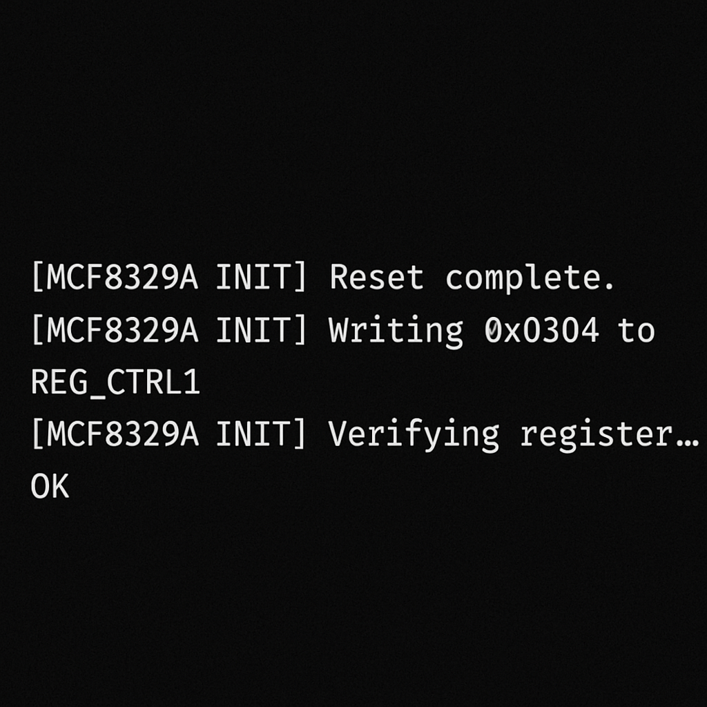
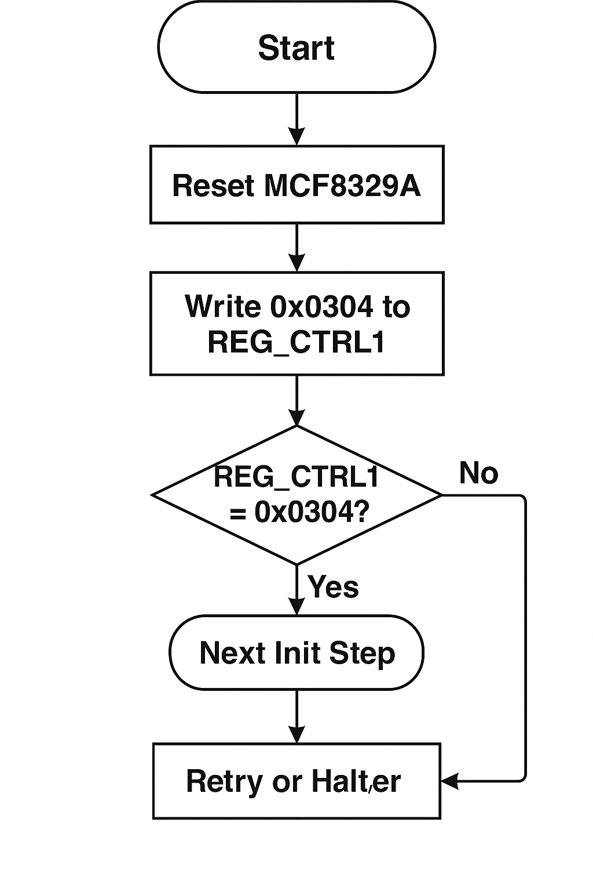

# MCF8329A_SPI_Init
A lightweight firmware example for initializing and communicating with the **TI MCF8329A BLDC motor driver** over SPI. Designed for STM32 or similar MCUs, this project demonstrates register setup, SPI communication routines, and UART-based debug output for testing and integration.

## Project Structure
<pre lang="markdown"> <code>## Project Structure <code>MCF8329A_SPI_Init/ ├── src/ │ ├── mcf8329a_spi.c # SPI communication routines │ ├── mcf8329a_spi.h # Header for SPI logic │ ├── main.c # System init and demo testing │ └── uart_debug.c # UART-based debug output (optional) ├── include/ # Header files (unspecified content) ├── docs/ # Documentation assets (e.g., diagrams) ├── examples/ # Sample register writes / sequences ├── Makefile or .ioc # Build configuration (Make or CubeMX) └── README.md # Project documentation</code> </pre>

## Features
I. SPI-based register access to the MCF8329A  
II. Initialization sequence based on TI datasheet  
III. Optional UART debug messages for diagnostics  
IV. Clean and portable C code for STM32, NXP, or other MCUs  
V. Example register map included

## SPI Write Timing Diagram

This diagram illustrates how 0x02 (register) and 0x0304 (16-bit data) are transmitted over MOSI with respect to CS and SCLK lines.



## MCF8329A Register Initialization Flow

The diagram below outlines the full sequence of steps for bringing up the MCF8329A driver from power-up to operational state.



## MCF8329A Block Diagram
The diagram below provides a simplified internal view of the MCF8329A device to help understand its control and communication architecture.



## Getting Started
This section will help you set up and run the firmware on your hardware for the first time.
## I. Hardware Requirements
STM32 Nucleo or Blue Pill development board
TI MCF8329A BLDC motor driver or evaluation board (EVM)
USB-to-UART converter (optional, for debugging)
SPI connection (MOSI, MISO, SCLK, CS)
3.3V or 5V regulated power supply (depending on board spec)

### Wiring Diagram:
The following diagram shows SPI and UART wiring connections between the STM32 and the MCF8329A motor driver.



## II. Software Requirements
STM32CubeIDE or STM32CubeMX
GCC toolchain (if using Makefile)
STM32 HAL drivers (pre-installed via CubeIDE)
Serial monitor (e.g., Tera Term, PuTTY) for UART output

## III. Build Instructions
# Option A: STM32CubeIDE
Clone the repo or download the ZIP
Open STM32CubeIDE → Import project
Connect your STM32 board via USB
Click Build → then Debug/Run
## Option B: Command Line (Makefile)
Clone the repo
Navigate to the project folder
# Run:
make clean && make
Flash using st-flash, openocd or your preferred tool

## IV. UART Debug Output (Optional)
Connect TX pin of STM32 to your USB-to-UART converter  
Set baud rate to 115200  
Open a serial monitor (e.g., Tera Term or PuTTY) and observe output like:



## V. Customizing SPI Commands
Edit mcf8329a_spi.c to change register addresses or values.  
Reference the TI MCF8329A datasheet for available registers and command protocol.



## Requirements
- STM32 Nucleo or similar dev board  
- TI MCF8329A EVM or custom BLDC driver board  
- UART-to-USB interface for debug (optional)

## Build & Flash
1. Clone the repo  
2. Import into STM32CubeIDE or build with Makefile  
3. Connect SPI and UART to target hardware  
4. Flash and monitor UART output

## Sample Output
```text
[MCF8329A INIT] Reset complete.
[MCF8329A INIT] Writing 0x0304 to REG_CTRL1
[MCF8329A INIT] Verifying register... OK

## References
TI MCF8329A Datasheet
SPI Peripheral Programming Guide

